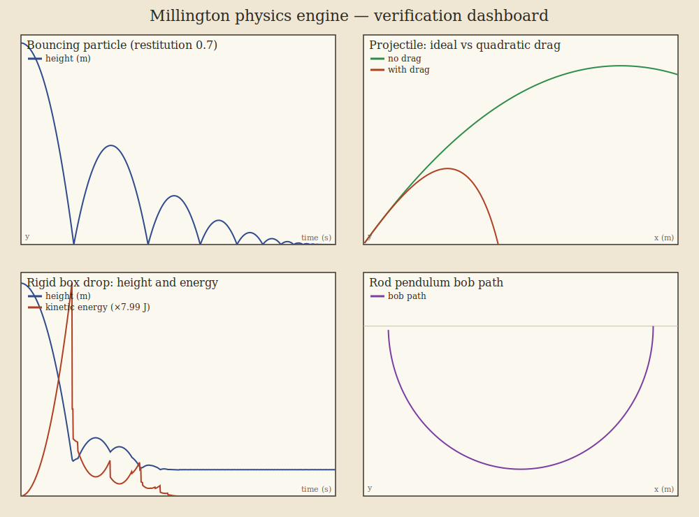
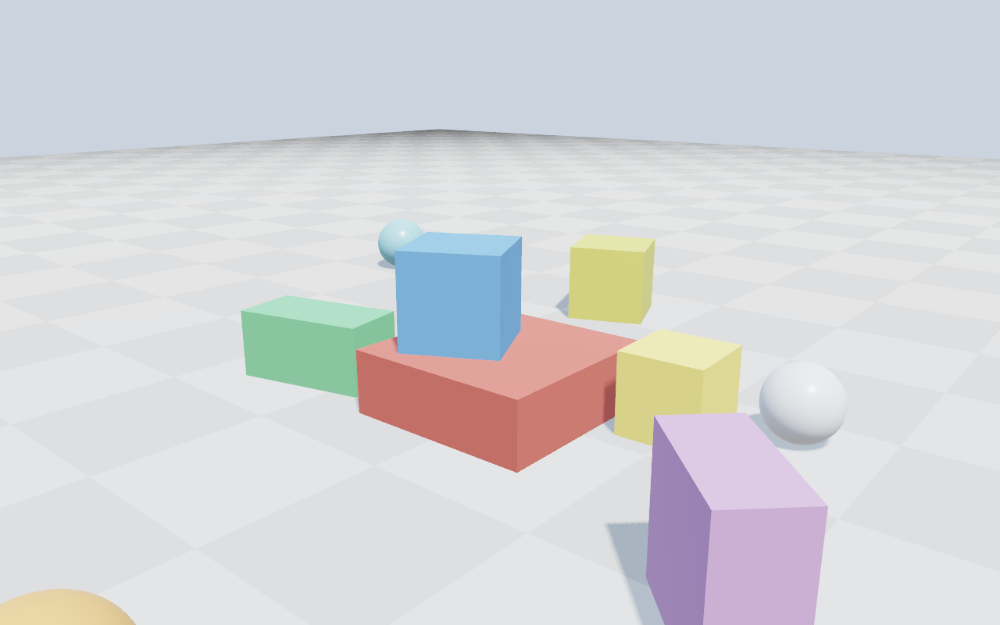
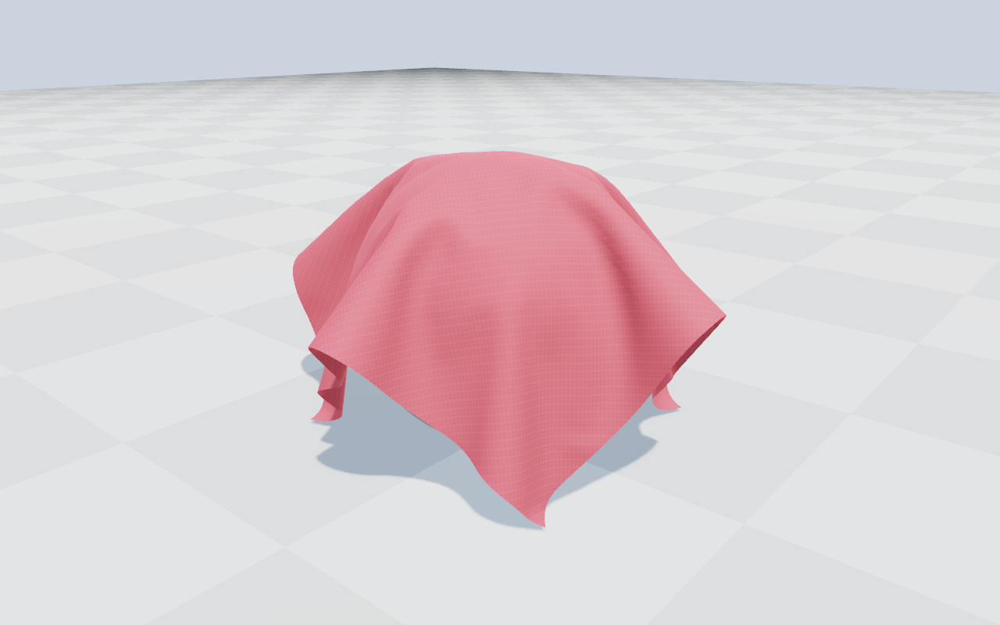
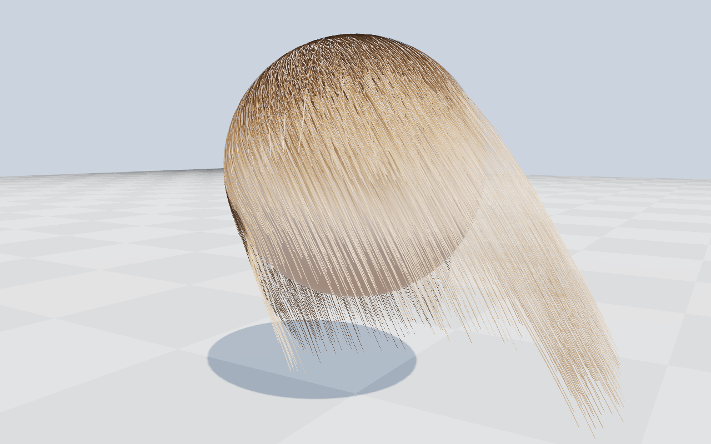
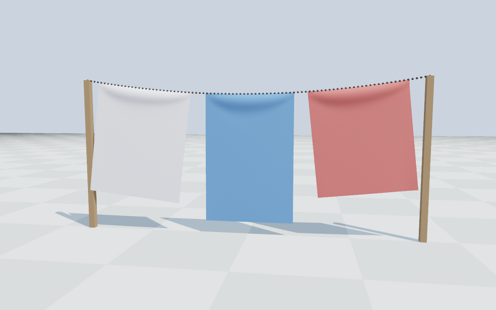
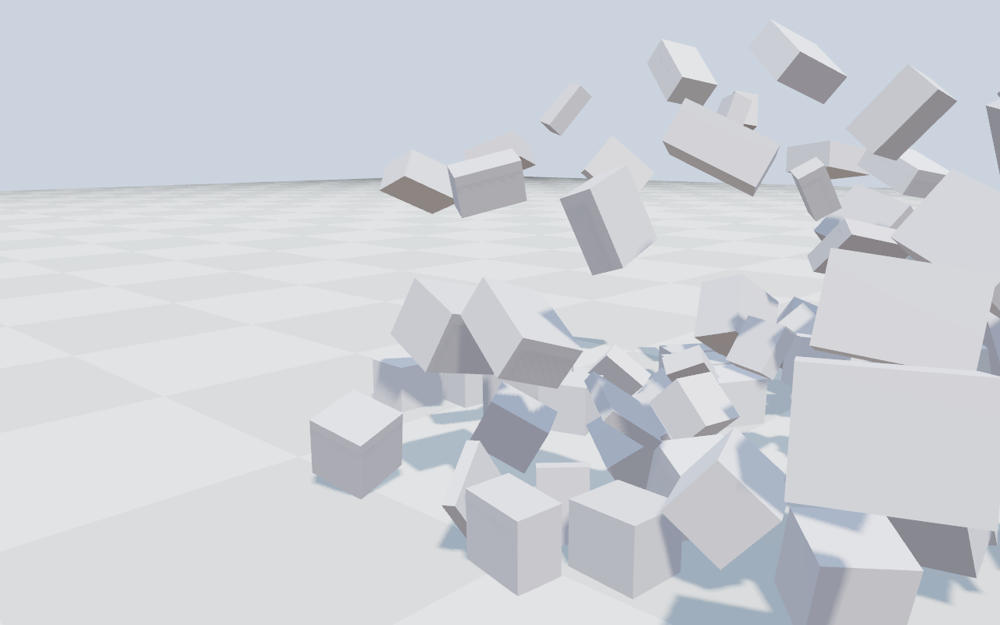
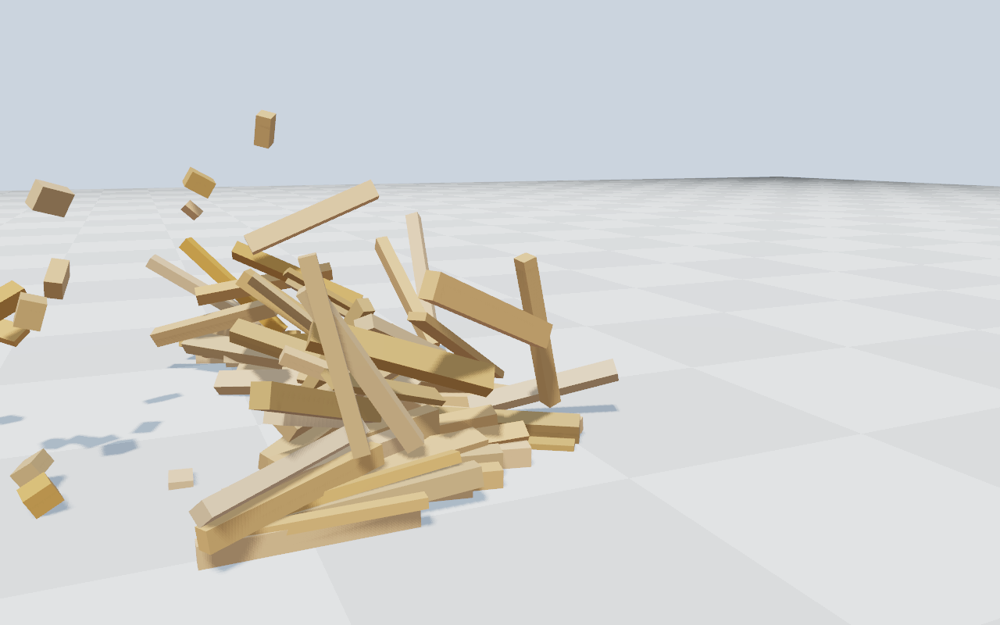

# A game physics engine (Millington's *Cyclone*, from scratch)

A complete C++ rigid-body physics engine implementing the architecture of Ian
Millington's **_Game Physics Engine Development_** — particles, mass-aggregate
systems, rigid bodies, coarse + fine collision detection, and the full
contact-resolution pipeline. Header-only, double precision, dependency-free, with
a physical test suite covering every layer.



## What's implemented (mapped to the book)

| Part | Chapters | Feature | Files |
|------|----------|---------|-------|
| — | — | Vector3, Quaternion, Matrix3, Matrix4 (transforms, inverse, inertia) | `core.h`, `precision.h` |
| I | 3–4 | Particle + semi-implicit Euler integration | `particle.h` |
| II | 5–6 | Force generators: gravity, drag, spring, anchored spring, bungee, buoyancy, stiff (analytic) spring | `pfgen.h` |
| II | 7 | Particle contacts + resolver (velocity impulse & interpenetration, resting-contact correction) | `pcontacts.h` |
| II | 7 | Hard constraints: cables, rods, and anchored variants | `plinks.h` |
| II | 8 | Mass-aggregate particle world | `pworld.h` |
| III | 9–10 | Rigid body: 6-DOF integration, world inertia tensor, sleep system | `body.h` |
| III | 11 | Rigid-body force generators: gravity, spring, aero + control surface, buoyancy | `fgen.h` |
| IV | 12 | Broad phase: bounding-sphere hierarchy (BVH), potential contacts | `collide_coarse.h` |
| IV | 13 | Narrow phase: sphere/box/plane primitives, intersection tests, contact generation incl. **box-box SAT** | `collide_fine.h` |
| V | 14–15 | Contact + resolver: impulse velocity resolution, anisotropic **friction**, nonlinear position projection | `contacts.h` |
| V | 15 | Rigid-body world; ball-and-socket **joints** | `world.h`, `joints.h` |
| — | app. | Deterministic random source (vectors, quaternions) | `random.h` |
| + | — | **Cloth** — Verlet + structural/shear/bend constraints, sphere/ground collision with friction, wind | `cloth.h` |
| + | — | **Hair** — Verlet strands with segment + bend constraints, head collision, gusting wind + turbulence | `hair.h` |
| + | — | **Destruction & explosions** — grid/jitter box fracture, **Voronoi** irregular convex chunks, radial+concentric **impact ("bullet-hole") glass fracture**, or **hollow-cylinder shell fracture** (regular grid, or Voronoi-style **irregular** metal shards) (all with exact volume/COM/inertia); `detonate()` a charge for a radial blast-overpressure explosion with an upward plume | `fracture.h`, `voronoi.h`, `glassfrac.h`, `shellfrac.h` |
| + | — | **Spring harmonics** — coupled spring-mass lattice (Hooke links via `ParticleSpring`, fixed ends) on the engine's particles with a symplectic step; excites the analytic normal modes / standing-wave harmonics `ω_n = 2√(k/m)·sin(nπ/2(P+1))` | `springs.h` |
| + | — | **Falling burning leaf** — tumbling-plate aerodynamics (anisotropic drag, reactive lift, underdamped broadside-seeking torque → flutter/tumble/spiral descent) coupled to a per-leaf combustion CA over an oak silhouette (ignite, glowing front, char, holes, curl) | `leaf.h` |
| + | — | **Non-Newtonian fluids** — weakly-compressible **SPH** (poly6/spiky/viscosity kernels, grid neighbour search, XSPH) with a *shear-rate-dependent* Herschel–Bulkley/power-law viscosity `μ(γ̇)` → shear-**thickening** (oobleck), shear-**thinning** (ketchup), **yield-stress**/Bingham (**lava**) and Newtonian fluids; two-way-coupled rigid balls, static cylinder obstacles, runtime emitters/drains | `sph.h` |
| + | — | **Screen-space fluid surface** — particles → eye-space depth → bilateral smoothing → normal reconstruction → shaded liquid (glossy Fresnel or molten blackbody emissive); makes SPH read as a surface, not spheres | `demos/common/fluidsurf.h` |
| + | — | **Framework parity** (vs Brax/Chrono/Gazebo/MuJoCo/ODE/PhysX/PyBullet/Webots/Unity — see [FEATURES.md](FEATURES.md)): capsules, raycasts, hinge/slider/fixed/distance/universal/gear joints + limits + motors + PD servos, heightfield terrain, CCD, contact events, triggers, kinematic bodies, RK4, raycast vehicle, character controller | `shapes.h`, `raycast.h`, `joints2.h`, `terrain.h`, `extras.h`, `vehicle.h`, `character.h` |
| + | — | **Convex & mesh geometry** — arbitrary convex hulls (GJK boolean + closest-distance + EPA penetration), analytic cylinder & cone, static triangle-mesh collider with grid midphase | `collide_convex.h` |
| + | — | **Articulated bodies** — Featherstone O(n) articulated-body algorithm in reduced (joint) coordinates for serial/tree chains of revolute/prismatic joints | `articulation.h` |
| + | — | **Contact solver upgrade** — persistent up-to-4-point manifolds with warm-started impulses, `Material` + combine modes (Average/Min/Max/Multiply), rolling & spinning friction | `contacts.h`, `material.h` |
| + | — | **Soft bodies & PBF** — co-rotational tetrahedral FEM deformables, cloth self-collision, position-based fluids | `softbody.h` |
| + | — | **Soft constraints & fields** — CFM/ERP springy link, breakable joint, conveyor surfaces, wind/radial force fields, rigid hydrodynamics, backward-Euler implicit spring | `constraint2.h` |
| + | — | **Scene queries & broad phases** — swept + overlap queries, speculative contacts, sweep-and-prune, dynamic AABB tree, state snapshot/restore | `query.h`, `broadphase2.h`, `serialize.h` |
| + | — | **Robotics layer** — URDF/MJCF loader, IMU/lidar/contact-force sensors, recursive-Newton-Euler inverse dynamics, Jacobian IK, tendon/muscle actuators | `loader.h`, `robotics.h` |
| + | — | **Advanced paradigms** — forward-mode autodiff → differentiable physics, island-parallel `std::thread` solver, approximate convex decomposition (V-HACD-lite) | `autodiff.h`, `parallel.h`, `decompose.h` |
| + | — | **GPU execution** — a CUDA massively-parallel SPH fluid (spatial-hash grid, thrust sort, on-GPU density/force/integrate), with **surface-tension cohesion** (Becker–Teschner), **axis-aligned box (SDF) obstacles** and a **recirculating emitter** (drained particles respawn at a source → continuous inflow at fixed N); ~360k particles at ~0.19 ms/step (≈1.9·10⁹ particle-steps/s) on an RTX 5090, driving a **2.4M-particle waterfall** | `gpu/gpu_sph.cuh` |
| + | — | **ROS/ROS2 bridge** — ROS2-compatible messages (Imu, LaserScan, JointState, Odometry, tf2) + node/publisher/subscription graph over an in-process transport, bindable to real `rclcpp` | `ros_bridge.h` |
| + | — | **Compound (multi-shape) bodies** — one rigid body carrying several offset box/sphere primitives, with aggregate mass, centre of mass and the full parallel-axis inertia tensor computed for you | `compound.h` |
| + | — | **Maxwell's equations (FDTD)** — Yee-grid leapfrog of the curl equations (TM & TE), PEC / absorbing boundaries; reproduces cavity resonances to 0.01% and wave propagation at the speed of light | `fdtd.h` |
| + | — | **Antenna analysis (Method of Moments)** — thin-wire dipole EFIE (Pocklington, pulse basis, delta-gap feed): current distribution, input impedance (~73 Ω near resonance), radiation pattern | `mom.h` |

Include everything with `#include "phys/phys.h"`; the namespace is `phys`.  The
cloth and hair modules (extensions beyond the book, driving the 3D demos) are in
`phys/cloth.h` and `phys/hair.h`.

## Build & test

Header-only — just add `include/` to your include path. To build the tests and
the demo:

```sh
cmake -B build -S . && cmake --build build && ctest --test-dir build   # via CMake
bash tests/run_all.sh                                                  # or directly with g++
./build/demo docs/physics_demo.svg                                     # regenerate the dashboard
```

## Verification

Every layer is checked against analytic or known-physical results
(`tests/*.cpp`, **585 assertions, all passing** — 23 suites, incl. a CUDA GPU suite):

| Suite | What it proves |
|-------|----------------|
| `core` | dot/cross, matrix inverse `M·M⁻¹=I`, quaternion→matrix rotation, transform round-trips, quaternion-integration convergence |
| `particle` | projectile matches `v=v₀+at`; spring settles at `rest+mg/k`; rod holds length; ball rebounds to `e²h`; cable never over-extends |
| `rigidbody` | free fall; torque gives `I⁻¹τ`; torque-free spin is conserved; off-centre force makes the right torque; world inertia tensor rotates correctly |
| `collision` | sphere/sphere, sphere/plane, box/plane (4 corners), box/sphere, **box/box** penetration & normals; BVH finds the overlapping pair only |
| `resolution` | a box settles at the right height; bounces; friction decelerates a slide; a sphere rests; an elastic bounce conserves height |
| `stacking` | interpenetrating boxes separate; a box comes to rest on a fixed box (box-box in the pipeline) |
| `harmonics` | chain mode frequencies match `ω_n = 2√(k/m)·sin(nπ/2(P+1))`; a single mass gives `√(2k/m)`; modes are ordered; an undamped chain conserves energy; a tensioned chain gives a near-linear overtone series |
| `sph` | the `μ(γ̇)` rheology thickens/thins/yields correctly; an SPH pool settles, conserves particle count and stays inside its box with no NaNs; a shear-thickening pool holds a dropped ball higher than water; runtime add/remove stays in sync and a cylinder ejects particles from its footprint |
| `convex` | GJK boolean + distance and EPA penetration on convex hulls (aligned/offset/rotated); sphere & box rest on a triangle-mesh ramp; cylinder/cone vs plane |
| `articulation` | a Featherstone pendulum's period = `2π√(I/mgl)`; released-link acceleration = `mgl/I`; a free 2-link chain conserves energy; a holding torque keeps a link static |
| `contacts2` | material combine modes; a warm-started stack settles with less penetration in fewer iterations; rolling friction brings a rolling sphere to rest |
| `softbody` | polar decomposition recovers rotation/identity; a dropped soft box squashes and rebounds keeping its volume; self-collision separates overlapping particles; PBF holds rest density |
| `constraint2` | CFM softness lowers restoring force; a breakable joint fires exactly at its load; a conveyor drives a box to belt speed; hydrodynamic drag gives a bounded terminal velocity; the implicit spring stays stable where explicit diverges |
| `query` | a swept sphere catches a target it would tunnel past; sweep-and-prune and the dynamic AABB tree match brute-force pairs; snapshot→restore is bitwise-exact |
| `robotics` | URDF/MJCF parse to the right links/joints; IMU reads `g` when static; RNE gravity torque = `mgl`; Jacobian IK error decreases monotonically; lidar returns the expected ranges |
| `advanced` | autodiff gradients match finite differences; the island-parallel solver is bit-identical to serial; an L-shape decomposes into convex pieces covering its area |
| `gpu` (CUDA) | the GPU grid density equals the CPU brute-force reference; a dropped block stays finite/in-bounds near rest density; scales to >200k particles at <60 ms/step; a solid **box obstacle** is never penetrated; the **recirculating emitter** conserves particle count and leaves none below the drain plane; **surface-tension cohesion** makes a free blob more compact |
| `ros` | the node graph delivers every published message to all subscribers; Imu/LaserScan/JointState round-trip; sim→ROS adapters build well-formed messages |
| `compound` | a multi-shape body aggregates total mass, centre of mass and the parallel-axis inertia tensor (barbell/stack); child primitives land at the right COM-relative world offsets; it integrates as one rigid body |
| `em` | FDTD reproduces a PEC-cavity eigenfrequency to within 0.01% of `(c/2)√((1/Lx)²+(1/Ly)²)` and a wavefront travels at 0.9975 c; the leapfrog stays energy-bounded for 3000 steps; the MoM dipole gives a near-resonant Rin ≈ 73 Ω, a symmetric feed-peaked current, capacitive→inductive reactance, and a radiation pattern with a deep axial null |
| `explosion` | grid fracture conserves the block's volume and fragment count exactly; **Voronoi fracture partitions the block (Σ cell volume ≈ box) into convex cells with valid mass properties**; the radial+concentric **glass fracture** likewise tiles the pane (minus the punched hole) into thin convex shards, and the **hollow-cylinder shell fracture** dices the barrel wall (regular grid or **irregular Voronoi**) into small convex metal pieces that tile the shell; `detonate()` throws every fragment radially outward with a net upward plume momentum, its blast energy scales with the square of the charge strength, and fragments outside the blast radius stay asleep |
| `leaf` | the oak mask is a proper silhouette with veins; a dropped leaf falls at bounded speed, drifts sideways (flutters) and keeps an orthonormal frame; an unlit leaf keeps its fuel while an ignited one burns down to nothing |

The dashboard above is produced by `demos/demo.cpp` and shows, with no tuning:
decaying restitution bounces, quadratic drag shortening a projectile's range, a
tumbling box settling as its kinetic energy spikes-then-decays to zero, and a rod
pendulum tracing a constant-radius arc.

## 3D OpenGL demos

Three interactive real-time demos live in `demos/` and render with a small
modern-OpenGL pipeline (`demos/common/`): directional-light **shadow mapping**
(PCF), **Cook-Torrance PBR**, 4× **MSAA** and **ACES** tonemapping.

| Demo | What it shows |
|------|---------------|
| `rigid3d` | boxes and spheres dropping and piling up — the engine's rigid bodies, collision detection and contact resolver in 3D |
| `cloth3d` | a woven sheet draping over a sphere and pooling on the floor (`phys::Cloth`), two-sided fabric shading with sheen |
| `hair3d`  | ~3400 simulated guide strands → **24k rendered strands** via clumping (`phys::Hair`), **Kajiya-Kay** anisotropic shading, gusting wind |
| `clothesline3d` | garments pinned along a sagging string, hanging and swaying in a breeze (`phys::Cloth`) |
| `destruction3d` | a solid block shattered by a wrecking ball — **granite** chunks or **wood** splinters (`phys::fracture`) |
| `explosion3d` | a **concrete block detonated** — **Voronoi-fractured into ~78 irregular convex chunks** (not boxes) blasted radially outward by `Destructible::detonate`, colliding via GJK/EPA and settling into a rubble field, with an emissive fireball (blackbody ramp, HDR-bloomed) and a rising dust plume ([`docs/explosion.mp4`](docs/explosion.mp4)) |
| `bulletglass3d` | a **bullet through a pane of glass** — the window is pre-fractured with a realistic **impact pattern** (punched hole, radial spokes, concentric rings, fine shards at the entry, coarse plates at the rim) welded until the shot lands; the bullet punches through, the shards near the hole spall forward while the pane cracks free and falls, drawn as real **transparent Fresnel-edged glass** ([`docs/bulletglass.mp4`](docs/bulletglass.mp4)) |
| `bulletbarrel3d` | a **slow-motion chain reaction** — a bullet drifts through a glass window in bullet-time trailing a glowing **corkscrew vapor spiral**, shatters the pane (impact fracture), carries on and strikes one of **three hollow explosive barrels**; on the hit time ramps back to normal, the barrel bursts into **small irregular Voronoi metal shards** (shell fracture) and its blast **fuses the neighbouring barrels into a staggered chain explosion**, together shattering the crates, pillars and blocks around them. Four fracture types in one shot (glass impact + barrel shell + object Voronoi), all convex/GJK-EPA, contained by the room walls, with HDR fireballs + dust ([`docs/bulletbarrel.mp4`](docs/bulletbarrel.mp4)) |
| `bulletproofglass3d` | a **bullet stopped by bulletproof (laminated) glass** — the same impact fracture pattern, but the shards stay bonded so the pane holds; the round is arrested at the surface and a **milky-white crazed crater** (pulverized centre, radial + concentric cracks) spreads from the hit and fades to clear glass, while the spent, flattened bullet drops down the face ([`docs/bulletproofglass.mp4`](docs/bulletproofglass.mp4)) |
| `roomblast3d` | a **room full of objects and an explosion** — a block, pillars and a slab, each **Voronoi-fractured** into welded convex chunks, are shattered by a central charge; the fragments blast across an enclosed room and ricochet off its 6 walls (convex hull vs half-space, so nothing tunnels out) before settling into a coloured debris field, under a cutaway view with fireball + dust ([`docs/roomblast.mp4`](docs/roomblast.mp4)) |
| `burn3d` | a hanging **antique world map** — a scan of the 1900 *Larousse* planisphere (public domain), texture-mapped onto the cloth — lit at one corner burns diagonally: a fire-propagation cellular automaton (`phys::BurningPaper`) drives a glowing ragged front that chars the print to black, with curling, holes and rising smoke + embers, while a light gusting breeze + travelling-wave `flutter` make the sheet undulate as it burns |
| `harmonics3d` | six coil springs strung between posts, each ringing in a pure normal mode (1…6 antinodes) of a coupled spring-mass chain (`phys::SpringChain`) — the **harmonic series** as standing waves, the higher modes visibly faster; each coil is a helix swept along the live masses ([`docs/spring_harmonics.mp4`](docs/spring_harmonics.mp4)) |
| `nonnewtonian3d` | the same heavy ball dropped into two SPH troughs — shear-thickening **oobleck** vs **water** (`phys::SPHFluid`): the oobleck's viscosity spikes under the impact's shear and absorbs the ball with barely a splash, while the water erupts in a crown. Drawn as a smooth screen-space surface ([`docs/nonnewtonian.mp4`](docs/nonnewtonian.mp4)) |
| `lava3d` | **hyper-real lava** — a hot shear-thinning Bingham fluid (`phys::Rheology::lava`) poured down a tilted channel and flowing around a stone **cylinder**, splitting and rejoining in its wake; a per-particle temperature drives a molten blackbody glow (yellow-white vent → dark crust) over the screen-space fluid surface ([`docs/lava.mp4`](docs/lava.mp4)) |
| `galton3d` | a **Galton board** (bean machine / quincunx): 170 balls stream through a triangular peg lattice and pile into the bins as a **bell curve**, all on the engine's rigid-body collision resolver (spheres, immovable peg spheres, box bins, half-space walls) — the central limit theorem in action ([`docs/galton.mp4`](docs/galton.mp4)) |
| `articulation3d` | a Featherstone reduced-coordinate chain released from horizontal whips and swings as a multi-pendulum ([`docs/articulation.mp4`](docs/articulation.mp4)) |
| `softbody3d` | tetrahedral co-rotational **FEM jelly cubes** of varying stiffness drop and squash — softest pancakes, stiffest holds its cube ([`docs/softbody.mp4`](docs/softbody.mp4)) |
| `constraints3d` | a **conveyor belt** drags crates along and off the end into a pile while a crosswind field nudges them ([`docs/constraints.mp4`](docs/constraints.mp4)) |
| `robotics3d` | a serial arm tracks a moving target with **Jacobian IK** while a **lidar** fan scans the surrounding pillars ([`docs/robotics.mp4`](docs/robotics.mp4)) |
| `convex3d` | faceted **convex-hull gems** and cubes tumble and stack via GJK/EPA, with analytic cylinders and cones resting on the ground ([`docs/convex.mp4`](docs/convex.mp4)) |
| `stack3d` | a brick **pyramid** stands stable on the warm-started manifold solver, then a heavy ball plows through and scatters the crates ([`docs/stacking.mp4`](docs/stacking.mp4)) |
| `gpu_fluid3d` | a **GPU** SPH dam-break — ~905k fine particles simulated entirely on the RTX 5090 (`phys::gpu::GpuSPH`), read back and drawn as a screen-space fluid surface so the liquid reads as a continuous body, not spheres ([`docs/gpu_fluid.mp4`](docs/gpu_fluid.mp4)) |
| `waterfall3d` | a **GPU waterfall with real fluid dynamics** — **~2.4M** WCSPH particles (`phys::gpu::GpuSPH`) pour off a clifftop reservoir and plunge into a pool, with **surface-tension cohesion** holding the falling curtain together and **box (SDF) obstacles** for the cliff/floor/lip. It's a **recirculating** source/sink — particles that overflow the pool's front lip and drain respawn at the clifftop, so a fixed particle budget sustains a continuous fall. The water body renders as a screen-space surface graded from **clear blue-green** to **aerated whitewater** by a per-particle whitewater fraction (density + speed), with a light **foam-mist** billboard overlay on the most aerated water — clear at the lip, frothing as it falls, white spray at the plunge ([`docs/waterfall.mp4`](docs/waterfall.mp4)) |
| `em2d` | **Maxwell + Method of Moments** — a MoM-solved dipole current drives a 2-D FDTD run; renders the radiating magnetic field **H** (expanding wavefronts) with the electric field **E** as flow arrows, beside the MoM figure-8 radiation pattern and cosine current distribution ([`docs/em_antenna.mp4`](docs/em_antenna.mp4)) |
| `antenna3d` | **3-D dipole antenna** — the MoM far-field drawn as a glowing 3-D radiation-pattern surface with the wire glowing along its current and pattern-modulated wavefronts radiating out; the dipole length sweeps 0.5λ→1.5λ so the pattern morphs from the classic donut to a multi-lobe pattern ([`docs/antenna3d.mp4`](docs/antenna3d.mp4)) |
| `leaves3d` | **dozens of oak leaves spiralling down and burning** — tumbling-plate aerodynamics (`phys::FallingLeaf`) flutter each leaf down; it ignites partway and a combustion CA burns a glowing front across it, charring, curling and holing it before it is consumed, shedding smoke + embers. Leaves are **real oak-leaf photo textures** (a texture array; alpha defines each silhouette and drives the burn mask) ([`docs/burning_leaves.mp4`](docs/burning_leaves.mp4)) |
| `wall3d` | a metal ball punches **through** a concrete wall, releasing only the fragments inside a jagged angle-modulated radius — the wall survives with a ragged hole |
| `playground3d` | the framework-parity features in one scene: heightfield terrain, raycast **vehicle**, **character controller** hopping the dunes, motor-driven hinge **windmill**, **capsules** tumbling, and a **trigger zone** that lights up as the car passes ([`docs/playground.mp4`](docs/playground.mp4)) |








Rendered clips: [`cloth_drop.mp4`](docs/cloth_drop.mp4),
[`hair_wind.mp4`](docs/hair_wind.mp4), [`clothesline.mp4`](docs/clothesline.mp4),
[`destruction_granite.mp4`](docs/destruction_granite.mp4),
[`destruction_wood.mp4`](docs/destruction_wood.mp4),
[`wall_breakthrough.mp4`](docs/wall_breakthrough.mp4).

`destruction3d` takes `--material granite|wood`; the block is pre-split into
welded box fragments (`fractureBoxGrid`) that stay put until the ball's impact
calls `Destructible::shatter`, which bursts them apart with a radial + directional
impulse — from then on they are ordinary rigid bodies that collide and settle.

`burn3d` texture-maps a scan of the **1900 Larousse world planisphere**
("Planisphère des colonies européennes — Heure universelle", public domain, via
Wikimedia Commons) onto the burning cloth. The image is packed as zlib-compressed
RGB in `demos/assets/worldmap.pmz` and inflated at load, so run the demo from the
repo root (`./build/burn3d`) where that path resolves. The fire CA drives the char
(which blackens the print), holes and curl; the sheet texture is otherwise static.

`leaves3d` uses **real oak-leaf photo textures** (public domain / CC, via Wikimedia
Commons: a *Quercus rubra* autumn leaf plus *Quercus coccinea* scarlet-oak leaves
recoloured into autumn tints). They're cut out to alpha, packed as a zlib-compressed
RGBA texture array in `demos/assets/leaves.lefa`, and inflated at load — so run it
from the repo root. Each leaf's alpha both draws its silhouette and, sampled on a
grid, defines which cells can burn.

```sh
cmake --build build           # builds rigid3d, cloth3d, hair3d if GLFW/GLEW present
./build/rigid3d               # drag to orbit, scroll to zoom, Esc to quit
./build/cloth3d               # (hair3d likewise)
./build/cloth3d --shot out.png [frames]        # headless still
./build/cloth3d --video frames/f [nframes]     # headless image sequence for a video
```

Dependencies for the GL demos: **GLFW3, GLEW, GLM, zlib** (the engine and its
tests need none of these). Screenshots are written with a built-in zlib PNG
encoder; assemble a video from a `--video` sequence with any tool, e.g.
`ffmpeg -framerate 60 -i frames/f_%04d.png -pix_fmt yuv420p out.mp4`.

## Design notes / honest deviations

- **Header-only, `real = double`.** One `typedef` in `precision.h` switches to
  `float`; all maths goes through the `real_*` wrappers, as in the book.
- **Sleep system.** Bodies deactivate when their recency-weighted motion drops
  below `sleepEpsilon`. A body is constructed already above the threshold so it
  doesn't sleep on frame 1 (the book sets this when a body is woken).
- **Sphere-sphere contact point** uses the geometric overlap midpoint rather than
  the book's `positionOne + midline·½` (which can fall behind the first sphere) —
  more robust for the resolver's torque calculation.
- **Box-box** generates one contact (deepest feature) per pair, per the book, so
  large flat stacks rely on multiple frames to stabilise; point/edge and
  face/vertex cases are both handled via the 15-axis separating-axis test.
